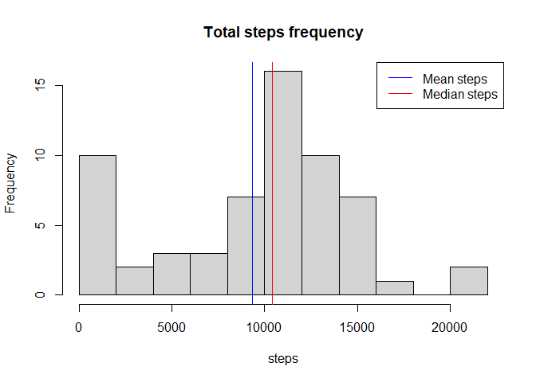
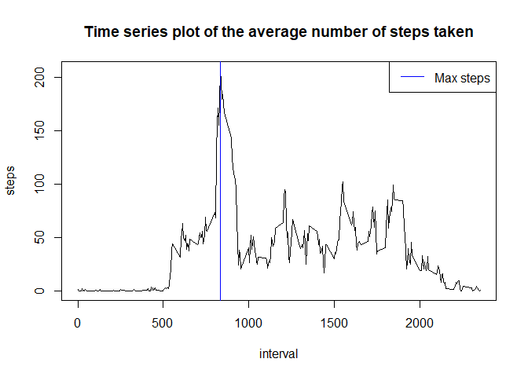
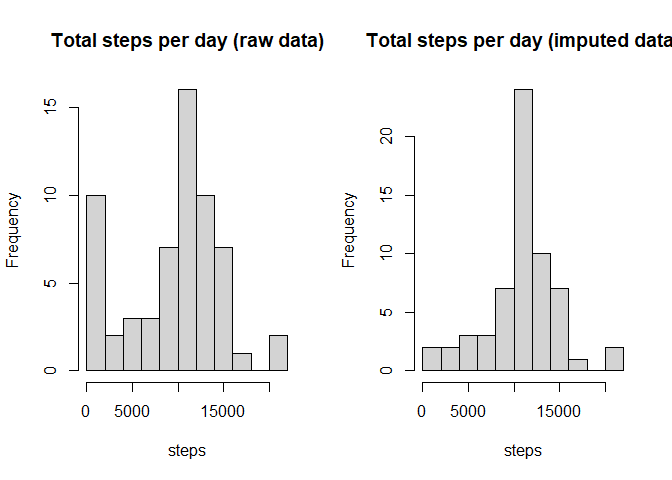

## Loading and preprocessing the data


```r
#load dplyr library to perform subsetting of data
library(dplyr)
library(ggplot2)
```


```r
#Name of the zip file on local repository
filename <- "./activity.zip"

#unzip it if it hasn't already been unzipped
if (!file.exists("./activity.csv")) { 
  unzip(filename) 
}

#read the activity.csv file
activity <- read.table("./activity.csv", sep = ",", header = TRUE)

#change object type of "date" variable for better manipulation
activity <- mutate(activity, date = as.Date(date))
```


## What is mean total number of steps taken per day?

```r
#make dataframe where each row is a day and its total steps
actByDate <- group_by(activity, date) %>%
  summarize(steps = sum(steps, na.rm = TRUE))

#total steps per day in pre-imputed data
summaryRawData <- summarize(actByDate, mean.raw = mean(steps), median.raw = median(steps))

knitr::kable(summaryRawData, caption = "Mean and median number of steps taken each day")
```


Table: Mean and median number of steps taken each day

| mean.raw| median.raw|
|--------:|----------:|
|  9354.23|      10395|

```r
#make histogram of steps taken each day
with(actByDate, hist(steps, breaks = 10))

#add vertical lines where the mean and median occur
with(actByDate, abline(v = c(mean(steps), median(steps)), col = c("blue", "red")))
legend("topright", legend = c("Mean steps", "Median steps"), col = c("blue", "red"), lty = 1)
```

<!-- -->


## What is the average daily activity pattern?

```r
#make dataframe where each row is an interval and its average steps
actByInterval <-  group_by(activity, interval) %>%
  summarize(steps = mean(steps, na.rm = TRUE))

#make time series plot of average steps depending on intervals
with(actByInterval, plot(interval, steps, type = "l", main = "Time series plot of the average number of steps taken"))

#5-minute interval that, on average, contains the maximum number of steps
maxStepInt <- subset(actByInterval, steps == max(steps))

knitr::kable(maxStepInt,caption = "5-minute interval that, on average, contains the maximum number of steps")
```


Table: 5-minute interval that, on average, contains the maximum number of steps

| interval|    steps|
|--------:|--------:|
|      835| 206.1698|

```r
#draw vertical line where max steps happen
with(maxStepInt, abline(v = interval, col = "blue"))
legend("topright", legend = "Max steps", col = "blue", lty = 1)
```

<!-- -->


## Imputing missing values

```r
# We will impute the missing values with the mean for that interval
activityImputed <- activity %>% group_by(interval) %>%
  mutate(steps=ifelse(is.na(steps),mean(steps,na.rm=TRUE),steps))

#make dataframe where each row is a day and its total steps
actImputedByDate <- group_by(activityImputed, date) %>%
  summarize(steps = sum(steps))

#total steps per day in imputed data. Can be compared to summaryRawData
summaryImputedData <- summarize(actImputedByDate, mean.imputed = mean(steps), median.imputed = median(steps))

knitr::kable(summaryImputedData)
```


| mean.imputed| median.imputed|
|------------:|--------------:|
|     10766.19|       10766.19|

```r
knitr::kable(summaryRawData)
```


| mean.raw| median.raw|
|--------:|----------:|
|  9354.23|      10395|

```r
par(mfrow = c(1, 2))
#make histogram of steps taken each day
with(actByDate, hist(steps, breaks = 10, main = "Total steps per day (raw data)"))
#make histogram of steps taken each day
with(actImputedByDate, hist(steps, breaks = 10, main = "Total steps per day (imputed data)"))
```

<!-- -->

## Do these values differ from the estimates from the first part of the assignment? What is the impact of imputing missing data on the estimates of the total daily number of steps?

It seems by the look of the histograms that the frequency for 0 steps decreases considerably, which sounds logical given that these values now become the mean for its corresponding interval. However, by looking at the mean and median of the imputed data above, little changes from raw to imputed, at least with this particular method.


## Are there differences in activity patterns between weekdays and weekends?

```r
#change language of environment to get dates in English (instead of native spanish)
Sys.setlocale("LC_TIME", "English")
```

```
## [1] "English_United States.1252"
```

```r
#vector with weekend days
weekendDays <- c("Saturday", "Sunday")

#create variable "day" which indicates whether the given day is a weekday or weekend
actWeekdays <- activityImputed %>% 
  mutate(day = factor((weekdays(date) %in% weekendDays), levels = c(TRUE, FALSE), labels = c("weekend", "weekday")))

#make dataframe with the average steps taken by interval and day category
actWeekdaysByInt <-  group_by(actWeekdays, interval, day) %>%
  summarize(steps = mean(steps))

plot <- ggplot(data=actWeekdaysByInt, aes(x = interval, y = steps)) + facet_grid(day ~ .) + geom_line(col = "blue") + 
  labs(title="Average number of steps by interval and day category", x ="Interval", y = "Steps") 

print(plot)
```

<!-- -->


